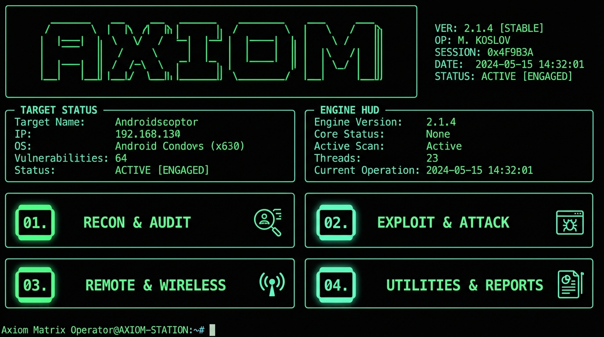

<div align="center">

# ⚡ Axiom
### Advanced Android Security Assessment Framework (Matrix Cyber Edition)

**Author:** Abdul Salam | Portfolio: [Salamcs.app](https://salamcs.app)
**Contact:** LinkedIn: [Abdul Salam](https://www.linkedin.com/in/abdul-salam-39467a274) | GitHub: [abdulsalam401](https://github.com/abdulsalam401)


<br/>



<br/>

> ⚠️ **For authorized security testing and educational purposes only.**

</div>

---

## 📌 Overview

**Axiom** is a comprehensive Android security assessment framework designed for ethical hackers, penetration testers, and security researchers. It features a futuristic **Matrix Cyber HUD** terminal interface with live target telemetry, static APK decomposition, vulnerability scanning, BlueZ Bluetooth exploitation (CVE-2023-45866), payload generation, wireless ADB discovery, and real-time GUI screen mirroring & remote control.

---

## ✨ Highlights & Features in v2.1.0

| Feature | Description |
|---|---|
| ⚡ **Matrix Cyber HUD** | 2x2 multi-column categorized dashboard with live target telemetry & 3D block banner |
| 💀 **BlueZ Exploit (CVE-2023-45866)** | Bluetooth HID keystroke injection exploit for unauthenticated remote access |
| 🖥️ **GUI Remote & Mirroring** | Real-time 30 FPS wireless screen mirroring with full mouse and keyboard interaction |
| 🔍 **Subnet Auto-Discovery** | Automatically scans WiFi subnets to discover and pair with open ADB devices |
| 🔎 **Static APK Decompiler** | Audits permissions, hardcoded secrets, exported components, and CVEs |
| 🚨 **Vulnerability Scanner** | Automated SDK CVE mapping, root detection, WebView & task hijacking checks |
| 🎯 **Payload Generator** | Generates msfvenom APKs, reverse shell one-liners, and obfuscated payloads |
| 📋 **Executive Reports** | Generates interactive HTML & structured JSON security assessment reports |
| 🚀 **Cross-Platform Launchers** | Auto-setup virtual environment scripts for Linux/macOS (`axiom.sh`) & Windows (`axiom.ps1`) |

---

## 🖥️ Terminal Interface Preview

```text
╔══════════════════════════════════════════════════════════════════════════════╗
║   █████╗ ██╗  ██╗██╗ ██████╗ ███╗   ███╗       ◈ ANDROID SECURITY FRAMEWORK  ║
║  ██╔══██╗╚██╗██╔╝██║██╔═══██╗████╗ ████║           ◈ AUTHOR : Abdul Salam    ║
║  ███████║ ╚███╔╝ ██║██║   ██║██╔████╔██║           ◈ SYSTEM : MATRIX v2.1.0  ║
║  ██╔══██║ ██╔██╗ ██║██║   ██║██║╚██╔╝██║           ◈ TIME   : 00:42:25       ║
║  ██║  ██║██╔╝ ██╗██║╚██████╔╝██║ ╚═╝ ██║                                     ║
║  ╚═╝  ╚═╝╚═╝  ╚═╝╚═╝ ╚═════╝ ╚═╝     ╚═╝                                     ║
╚══════════════════════════════════════════════════════════════════════════════╝
╭────────── 🎯 TARGET STATUS ──────────╮╭─────────── ⚡ ENGINE HUD ────────────╮
│  Target: Pixel 7 Pro  ● CONNECTED    ││  ADB Daemon:  ONLINE   │ BT: ACTIVE  │
│  Serial: 192.168.1.55:5555 (WiFi)    ││  Session:     Matrix Operator        │
╰──────────────────────────────────────╯╰──────────────────────────────────────╯
╭──────── 📡 01. RECON & AUDIT ────────╮╭────── 💀 02. EXPLOIT & ATTACK ───────╮
│  01  📱 Device Hardware & OS Info    ││  05  💥 Exploit Engine               │
│  02  🔎 APK Static Decompiler        ││  06  🎯 Payload Generator            │
│  03  🌐 Network Port Scanner         ││  18  💀 BlueZ Keystroke Exploit      │
│  04  🚨 Vulnerability & CVEs         ││  14  💻 Interactive Root Shell       │
│  12  🔐 SSL Pinning & Proxy Audit    ││  13  📂 Push / Pull File Transfer    │
╰──────────────────────────────────────╯╰──────────────────────────────────────╯
╭────── 🎮 03. REMOTE & WIRELESS ──────╮╭───── 🛠️  04. UTILITIES & REPORTS ─────╮
│  16  🎮 GUI Remote & Mirror          ││  07  📋 Generate Security Report     │
│  17  🔍 Auto-Discover & Connect      ││  10  📦 Package Manager              │
│  08  📡 Enable ADB over WiFi (TCP)   ││  11  🐛 Logcat Secret Sniffer        │
│  09  📸 Instant Screenshot           ││  15  ℹ️  About Axiom Framework        │
│                                      ││  00  🚪 Exit Session                 │
╰──────────────────────────────────────╯╰──────────────────────────────────────╯
```

---

## ⚡ Quick Installation (Windows & Linux)

Choose your preferred installation method below:

### 🚀 Option 1: One-Liner Terminal Installer (Recommended)

Installs Axiom into an isolated environment and links a global `axiom` command into your system PATH so you can launch it from **any** terminal directory.

#### 🐧 Linux, WSL, & macOS:
```bash
curl -sSL https://raw.githubusercontent.com/abdulsalam401/Axiom/main/install.sh | bash
```

#### 🪟 Windows (PowerShell):
```powershell
irm https://raw.githubusercontent.com/abdulsalam401/Axiom/main/install.ps1 | iex
```

Once installed, simply type **`axiom`** in any terminal!

---

### 🐍 Option 2: Python `pip` Package

Install Axiom directly as a Python CLI package:

```bash
# Install directly from GitHub:
pip install git+https://github.com/abdulsalam401/Axiom.git

# Or clone and install locally:
git clone https://github.com/abdulsalam401/Axiom.git
cd Axiom
pip install .
```

After installation, the **`axiom`** command will be available globally in your PATH.

---

### 🛠️ Option 3: Local Repository & Launchers

If you cloned the repository and want to run it directly:

#### 🐧 Linux / macOS:
```bash
git clone https://github.com/abdulsalam401/Axiom.git
cd Axiom
chmod +x install.sh axiom.sh
./install.sh   # Sets up global 'axiom' command
# Or run portable launcher:
./axiom.sh
```

#### 🪟 Windows (PowerShell):
```powershell
git clone https://github.com/abdulsalam401/Axiom.git
cd Axiom
.\install.ps1  # Sets up global 'axiom' command
# Or run portable launcher:
.\axiom.ps1
```

### Step 4: Install ADB (Android Debug Bridge)

**Linux (Native):**
```bash
sudo apt install adb
```

**Windows (for WSL users):**
* Download Platform Tools from: [Android Developers](https://developer.android.com/studio/releases/platform-tools)
* Extract to `C:\platform-tools`
* Add `C:\platform-tools` to System PATH

**macOS:**
```bash
brew install android-platform-tools
```

### Step 5: (Optional) Install GUI Dependencies

```bash
# For GUI Remote Control
pip install Pillow numpy

# For WSL Ubuntu users
sudo apt install python3-tk
```

---

## 🔌 Setting Up ADB for WSL (Windows Users)

If you're using WSL Ubuntu on Windows, you need to forward USB devices:

### Method 1: Using Windows ADB (Recommended)
```bash
# In WSL Ubuntu terminal, just use adb.exe
adb.exe devices

# Or create an alias
echo 'alias adb="adb.exe"' >> ~/.bashrc
source ~/.bashrc
```

### Method 2: USB Forwarding with usbipd-win
**Windows PowerShell (as Administrator):**
```powershell
winget install --id=dorssel.usbipd-win

# List USB devices
usbipd list

# Bind your Android device (replace BUSID with yours)
usbipd bind --busid 1-2

# Attach to WSL
usbipd attach --wsl --busid 1-2
```

**WSL Ubuntu:**
```bash
sudo chmod -R 777 /dev/bus/usb
adb devices
```

---

## 📱 Connecting Your Phone

### Enable Developer Options & USB Debugging
1. Go to **Settings** → **About Phone** → **Software Information**.
2. Tap **Build Number** 7 times.
3. Go back to **Settings** → **Developer Options**.
4. Enable **USB Debugging**.
5. Connect your phone via USB.

### First-Time Wireless Setup
```bash
# With USB connected
python3 axiom.py --remote-setup

# Follow the prompts:
# 1. USB detected ✓
# 2. ADB over WiFi enabled
# 3. Disconnect USB when prompted
# 4. Press Enter to connect wirelessly
```

### Quick Wireless Reconnect
```bash
# After initial setup
python3 axiom.py --remote-connect --remote-ip 192.168.x.x
```

---

## 🖥️ Usage

### Interactive Mode (Recommended)
```bash
python3 axiom.py
```

Main menu workflow breakdown:
* **📡 Recon & Audit:** `[01]` Device Info • `[02]` APK Decompiler • `[03]` Network Scanner • `[04]` Vulnerability & CVEs • `[12]` SSL Pinning
* **💀 Exploit & Attack:** `[05]` Exploit Engine • `[06]` Payload Generator • `[18]` BlueZ Keystroke (CVE-2023-45866) • `[14]` Root Shell • `[13]` File Transfer
* **🎮 Remote & Wireless:** `[16]` GUI Remote Control • `[17]` Subnet Auto-Discover • `[08]` Enable WiFi ADB • `[09]` Screenshot Capture
* **🛠️ Utilities & Reports:** `[07]` Executive Reports (HTML/JSON) • `[10]` Package Manager • `[11]` Logcat Sniffer • `[15]` About • `[00]` Exit

### CLI Mode Examples
```bash
# List connected devices
python3 axiom.py --devices

# Full device info
python3 axiom.py --device RZ8R50TKP3A --info

# Analyze APK
python3 axiom.py --apk target.apk --report html --target-name "MyApp"

# Full vulnerability scan
python3 axiom.py --device 192.168.10.3:5555 --vuln-scan --pkg com.example.app

# Port scan
python3 axiom.py --device 192.168.10.3:5555 --port-scan

# Capture screenshot
python3 axiom.py --device 192.168.10.3:5555 --screenshot
```

### Remote Control Commands
```bash
# Auto-detect connected device and start remote control menu (Recommended)
python3 axiom.py --remote
# or
python3 axiom.py -r

# Auto-detect connected device and take a screenshot
python3 axiom.py --screenshot
# or
python3 axiom.py -s

# One-time wireless setup (USB required first)
python3 axiom.py --remote-setup

# Interactive remote control (terminal) with manual IP
python3 axiom.py --remote-control --remote-ip 192.168.10.3

# GUI remote control with screen mirroring and manual IP
python3 axiom.py --gui-remote --remote-ip 192.168.10.3

# Stream screen as ASCII art
python3 axiom.py --remote-stream --remote-ip 192.168.10.3 --refresh 0.5

# Send touch event
python3 axiom.py --remote-tap 540 960 --remote-ip 192.168.10.3

# Send text
python3 axiom.py --remote-text "Hello World" --remote-ip 192.168.10.3

# Send key event
python3 axiom.py --remote-key home --remote-ip 192.168.10.3
```

---

## 🎮 GUI Remote Control Features

When you run `--gui-remote`, a graphical window opens with:

| Feature | Description |
|---|---|
| **Real-time Screen** | Live mirror of your phone display (~20-30 FPS) |
| **Mouse Click** | Click anywhere to tap on phone |
| **Mouse Drag** | Drag to swipe on phone |
| **Keyboard Input** | Type directly to phone |
| **Navigation Buttons** | Home, Back, Recent apps |
| **Screenshot** | One-click capture |
| **FPS Counter** | Monitor performance |
| **Refresh Rate** | Adjustable slider (0.3-3.0 sec) |

### GUI Keyboard Shortcuts
| Key | Action |
|---|---|
| **Home** | Home button |
| **Backspace** | Back button |
| **Enter** | Enter/OK |
| **Arrow Keys** | D-pad navigation |
| **+ / -** | Volume up/down |
| **Any text** | Types on phone |

---

## 🧩 Module Details

### APK Analyzer
* **Permission audit** — flags 30+ dangerous Android permissions by severity (CRITICAL → LOW)
* **Hardcoded secrets** — scans for API keys, passwords, AWS keys, Firebase configs
* **Exported components** — activities, services, receivers, providers
* **File hashes** — MD5, SHA1, SHA256
* **Obfuscation detection**, native libraries, embedded URLs & IPs
* **Vulnerability heuristics** — debuggable flag, backup enabled, no network security config

### Vulnerability Scanner
* **CVE Mapping** — 30+ CVEs mapped to Android SDK levels (Stagefright, BlueBorne, StrandHogg, BlueFrag)
* **Root detection** — su binary, Magisk, SuperSU, debuggable build
* **Frida detection** — checks running processes for Frida server
* **Insecure data storage** — SharedPreferences, SQLite, world-readable files
* **WebView checks** — JS enabled, file:// access
* **Task hijacking** — StrandHogg-style taskAffinity check

### Exploit Engine
| Module | Description |
|---|---|
| **Activity Launch** | Launch exported activities without permission |
| **Broadcast Trigger** | Send malicious broadcast intents |
| **Content Provider** | Dump arbitrary content provider data |
| **Deep Link Fuzzer** | Fuzz 20+ deep link paths for unprotected endpoints |
| **Frida Injection** | Step-by-step Frida/objection injection guide |
| **Reverse Shell Drop** | Push & execute busybox/nc reverse shell via ADB |
| **DB Extractor** | Pull SQLite databases from app data directory |
| **Lock Bypass** | PIN brute force via ADB keyevents |

### Payload Generator
| Type | Description |
|---|---|
| `reverse_tcp` | msfvenom Android Meterpreter reverse TCP APK |
| `reverse_https` | msfvenom HTTPS reverse shell APK |
| `reverse-shells` | 6 reverse shell one-liners (nc, bash, python3, perl, socat) |
| `adb-script` | Full ADB exploitation shell script |
| `obfuscate` | Base64 or hex payload obfuscation |

### Remote Control
| Mode | Description |
|---|---|
| **Terminal (ASCII)** | Screen stream as ASCII art in terminal |
| **GUI (Real-time)** | Graphical window with mouse/keyboard control |
| **Interactive** | Command-based control (tap, swipe, text, keys) |
| **Screenshot** | Single frame capture |

---

## 📋 Report Output

Axiom generates:
* **HTML Report** — dark glassmorphism theme, severity badges, finding cards with CVE links and remediation advice
* **JSON Report** — structured machine-readable output
* **CLI Table** — quick terminal summary sorted by severity (CRITICAL → LOW)

---

## 🔧 Requirements

### Python Packages (requirements.txt)
```text
rich>=13.0.0
requests>=2.31.0
colorama>=0.4.6
Pillow>=10.0.0
numpy>=1.24.0
```

### System Dependencies
| Requirement | Purpose | Installation |
|---|---|---|
| **Python 3.8+** | Runtime | `python3 --version` |
| **ADB** | Device communication | `sudo apt install adb` |
| **(Optional) Metasploit** | APK payload generation | [Install Guide](https://docs.metasploit.com/docs/using-metasploit/getting-started/nightly-installers.html) |
| **(Optional) Frida** | Runtime instrumentation | `pip install frida-tools` |
| **(Optional) mitmproxy** | Traffic interception | `pip install mitmproxy` |
| **(Optional) tkinter** | GUI remote control | `sudo apt install python3-tk` |

---

## 🐛 Troubleshooting

### ADB Not Found in WSL
```bash
# Use Windows ADB from WSL
adb.exe devices

# Or add to PATH
export PATH=$PATH:/mnt/c/Windows/System32
```

### Wireless Connection Refused
```bash
# Re-enable TCP mode
adb tcpip 5555
adb connect <DEVICE_IP>:5555
```

### GUI Remote Control Won't Start
```bash
# Install missing dependencies
pip install Pillow numpy
sudo apt install python3-tk
```

### Screen Stream Shows Garbage
```bash
# The ASCII stream works but may look distorted
# For better quality, use GUI mode:
python3 axiom.py --gui-remote --remote-ip <IP>
```

---

## 🔒 Security Notes
* ADB over WiFi exposes port 5555 — only use on trusted networks
* Disable wireless ADB when not in use: `adb disconnect`
* The tool is for authorized testing only
* Always get written permission before testing any system

---

## 📁 Project Structure
```text
Axiom/
├── axiom.py                 # Main entry point
├── modules/
│   ├── adb_manager.py       # ADB operations
│   ├── apk_analyzer.py      # APK static analysis
│   ├── network_scanner.py   # Network scanning
│   ├── vulnerability_scanner.py # Vulnerability checks
│   ├── exploit_engine.py    # Exploitation modules
│   ├── payload_generator.py # Payload generation
│   ├── report_generator.py  # Report generation
│   ├── remote_controller.py # Remote control (terminal)
│   └── gui_remote.py        # GUI remote control
├── requirements.txt         # Python dependencies
├── LICENSE.txt             # MIT License
└── README.md              # This file
```

---

## ⚠️ Legal Disclaimer

Axiom is intended **exclusively** for authorized security assessments, CTF competitions, and educational research.

**Unauthorized use of this tool against systems you do not own or have explicit written permission to test is illegal** under the Computer Fraud and Abuse Act (CFAA), Computer Misuse Act, and equivalent laws in most jurisdictions.

The author **Abdul Salam** and contributors assume **no liability** for any misuse or damage caused by this tool.

---

<div align="center"> Made with 💜 by <strong>Abdul Salam</strong> | <a href="https://salamcs.app">Salamcs.app</a> </div>